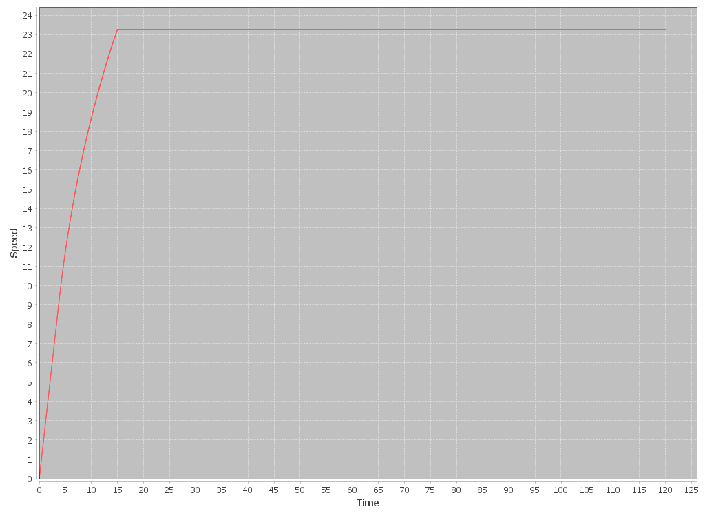

1.

2.
| Gear Ratio | Time to Reach 20m/s | Max Speed |
| -------- | -------- | -------- |
| 7 | 12.59s | 30 |
| 9 | 11.26s | 23 |
| 10.5 | Never Reaches | 19.95 |

3.
Higher Gear Ratio = Faster acceleration and more torque but reduces max speed.

4. 
Yes my simulation agrees with it, as 12.59 is close to 10s and in part 2 it doesn't include drivetrain efficency,torque and non-constant 
